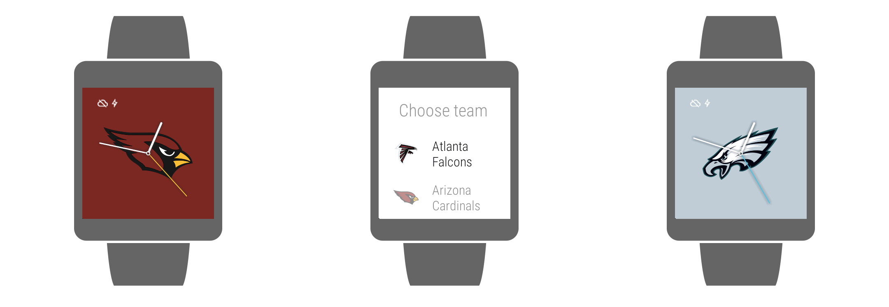

Football Face
=============

    

    

Football Face is a simple project that lets you select your desired NFL team to use as the watchface for your Android Wear device. The features include:

- Choose a team to use as your watch face (long press on watch face to do this)
- Ambient mode support (greyscale)

Currently supported teams include:

- Atlanta Falcons
- Arizona Cardinals
- Baltimore Ravens
- Buffalo Bills
- Carolina Panthers
- Chicago Bears
- Cincinnati Bengals
- Cleveland Browns
- Dallas Cowboys
- Denver Broncos
- Detroit Lions
- Green Bay Packers
- Houston Texans
- Indianapolis Colts
- Jacksonville Jaguars
- Kansas City Chiefs
- Miami Dolphins
- Minnesota Vikings
- New England Patriots
- New Orleans Saints
- New York Giants
- New York Jets
- Oakland Raiders
- Philadelphia Eagles
- Pittsburgh Steelers
- San Diego Chargers
- San Francisco 49ers
- Seattle Seahawks
- St. Louis Rams
- Tampa Bay Buccaneers
- Tennessee Titans
- Washington Redskins

Requirements
------------

 - [Android SDK](http://developer.android.com/sdk/index.html).
 - Android [5.0 (API 21) ](http://developer.android.com/tools/revisions/platforms.html#5.0).
 - Android SDK Tools
 - Android SDK Build tools 23.0.2
 - Android Support Repository
 - Android Support libraries

Building
--------

To build, install and run a debug version, run this from the root of the project:

    ./gradlew assembleDebug
